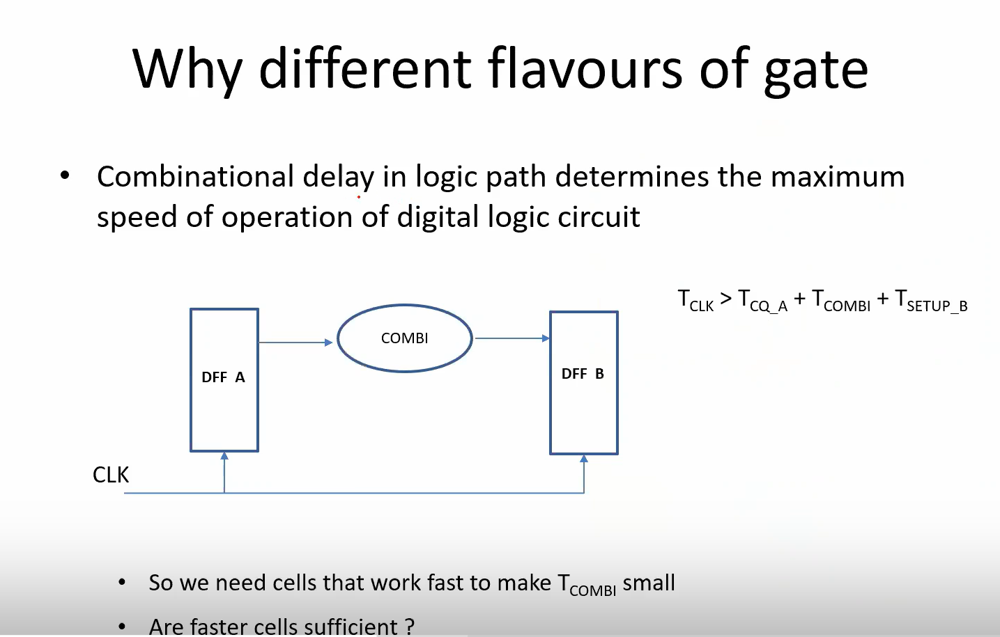
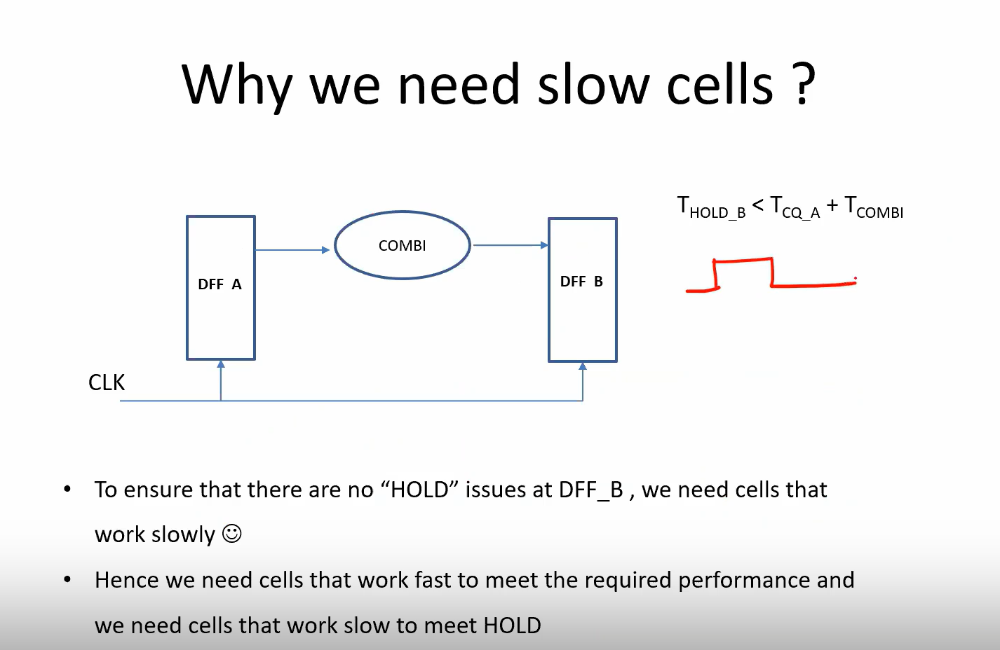
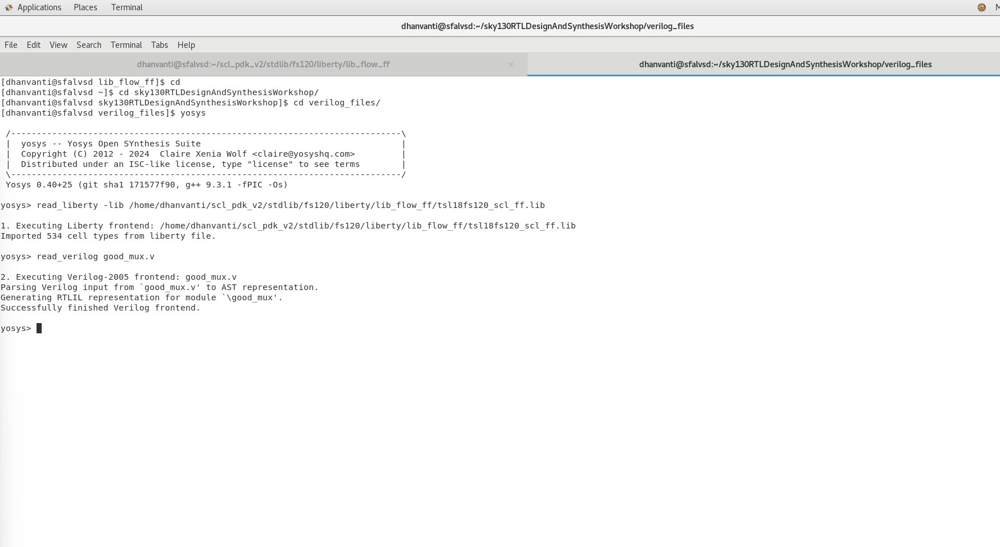
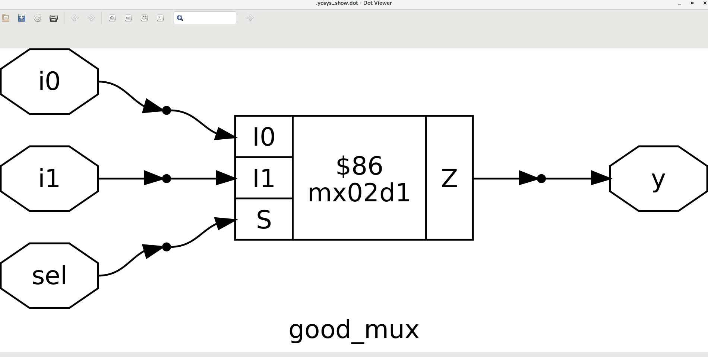

## Day1
<details>
<summary>  Introduction to verilog RTL design and Synthesis</summary>
- **RTL Design**: It is a method to describe digital circuits, focusing on data flow between registers and logical operations per clock cycle.Using HDLs like Verilog or VHDL, RTL specifies how data moves and transforms in sync with the clock.

### Introduction to open Source simulator iverilog
**Simulator**: It is a software tool that decides the begaviour of a digital circuit, allowing us to verify and debug RTL designs/

**Design**: It consist of interconnected verilog modules, each representing specific part of the digital system./

**Testbench**: It verifies that each module meets the specified functionality through simulation.If there is a change in input, then we can see the output. If no input changes, there is no change in output.

### Iverilog based simulation flow
Here the Design and testbench are given as a input to the iverilog.Iverilog generates VCD(Value Change Dump)file as a output which is then given to GTKwaves to generate the waveform.


</details>
<hr>
<details>
<summary> Labs using iverilog and gtkwave</summary>

#### Inroduction to lab
1. git clone https://github.com/kunalg123/sky130RTLDesignAndSynthesisWorkshop.git/
2. Check the verilog files folder/
3. Here we will use scl_pdk_v2/stdlib/fs120/liberty/lib_flow_ff library for synthesis.


#### Introduction to iverilog and gtkwave
1. Open the terminal and navigate to the verilog files folder/
2. Load the verilog file and its testbench using ` iverilog good_mux.v tb_good_mux.v` and run the output file`a.out`
3. Open the gtkwave and load the vcd file generated by iverilog using `gtkwave tb_good_mux.vcd`

\

</details>
<hr>
<details>
<summary> Introduction to Yosys and logic synthesis</summary>

#### Introduction to yosys
It is an open-source tool for synthesizing digital logic, primarily from Verilog designs, into gate-level representations.


#### Introduction to Logic Synthesis
Synthesis involves
1. **Translation** - It converts HDL code(verilog) into an internal representation.
2. **Optimization** - It optimizes the design in terms of area, speed, power by simplifying gate structures.
3. It gives the Netlist cosisting of gates and there interconnection


#### Why different flavors of gate?


#### Why do we need Slow cells?


#### Faster Cells Vs Slower Cells


#### Synthesis Illustration

</details>
<hr>
<details>
<summary>Labs Using Yosys and scl180 PDKs</summary>
Steps

```
# Invoke yosys
yosys 

# Read liberty files
read_liberty -lib /home/dhanvanti/scl_pdk_v2/stdlib/fs120/liberty/lib_flow_ff/tsl18fs120_scl_ff.lib 

# Read verilog files
read_verilog good_mux.v

# Run synthesis on top level module
synth -top good_mux

# logic optimization using ABC algorithm
abc -liberty /home/dhanvanti/scl_pdk_v2/stdlib/fs120/liberty/lib_flow_ff/tsl18fs120_scl_ff.lib

# Write netlist file
write_verilog good_mux_netlist.v

# Write precise netlist file
write_verilog -noattr good_mux_netlist.v
```





</details>
<hr>