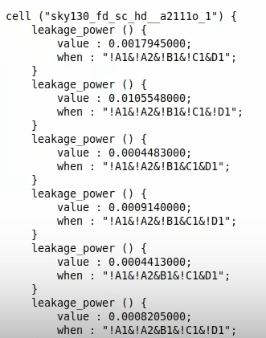
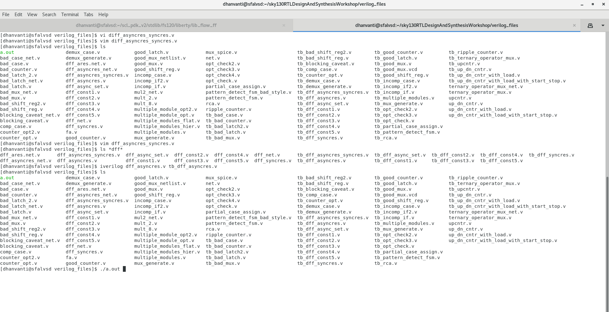
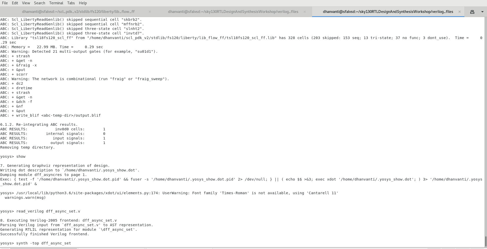

## Day 2
### Timing Libraries, Hierarchical vs Flat Synthesis, and Efficient Flop Coding Styles
#### Introduction to timing.libs
The sky130_fd_sc_hd__tt_025C_1v80.lib timing library is part of the SkyWater 130nm PDK
- **sky130**: Refers to the SkyWater 130nm technology node.
- **fd_sc_hd**: Specifies the "fully-depleted standard cell, high-density" library.
- **tt_025C**: Stands for "typical-typical" process corner at 25°C.
- **1v80**: Represents the nominal voltage, 1.8V


#### Undestanding the cells
A cell in the sky130_fd_sc_hd_tt_025C_1v80.lib timing library includes:
```
Power: Leakage and dynamic power, with look-up tables for power based on input transitions and capacitance.
Area: Physical cell area in square microns, crucial for layout planning.
Timing: Delay, setup, hold times, and timing arcs for input-output relationships.
Capacitance: Input/output pin capacitance impacting speed and loading.
Functionality: Logic function (e.g., AND, OR) and drive strength (e.g., NAND2_X1).
```



### Hierarchial vs Flat Synthesis
In Hietarchial synthesis, each module in the design is synthesized individually, then combined at higher levels.
In Flat synthesis, the entire design is synthesized at once, without hierarchical decomposition.

#### Hierarchial Synthesis
Steps
```
# Invoke yosys
yosys 

# Read liberty files
read_liberty -lib /home/dhanvanti/scl_pdk_v2/stdlib/fs120/liberty/lib_flow_ff/tsl18fs120_scl_ff.lib 

# Read verilog files
read_verilog multiple_modules.v

# Run synthesis on top level module
synth -top multiple_modules

# logic optimization using ABC algorithm
abc -liberty /home/dhanvanti/scl_pdk_v2/stdlib/fs120/liberty/lib_flow_ff/tsl18fs120_scl_ff.lib

#show the module
show
```


Output


#### Flat Synthesis
Steps
```
flatten
write_verilog -noattr multiple_module_flat.v
!gvim multiple_module_flat.v
```


#### Submudule level Synthesis
Repeat the above steps and do the synthesis for sub_module1


### Flop Coding Styles
Flops are important to minimize the glitches.
Here we are going to see various flip flops and its coding

1. dff_asyncres.v

```
module dff_asyncres ( input clk ,  input async_reset , input d , output reg q );
always @ (posedge clk , posedge async_reset)
begin
  if(async_reset)
    q <= 1'b0;
  else	
    q <= d;
end
endmodule
```



2. dff_async_set.v
```
module dff_async_set ( input clk ,  input async_set , input d , output reg q );
always @ (posedge clk , posedge async_set)
begin
    if(async_set)
        q <= 1'b1;
    else	
        q <= d;
end
endmodule
```


#### Flop Synthesis

```
invoke yosys
read_verilog dff_asyncres.v
Define the module to be synthesized
```
1. dff_asyncres.v


2. dff_async_set.v




3. dff_syncres.v


#### Special Case Optimization


1. mul2 Synthesis
```
read_verilog mult_2.v
synth -top mult2
```


2. mul8 Synthesis
```
read_verilog mult_8.v
synth -top mult8
```


